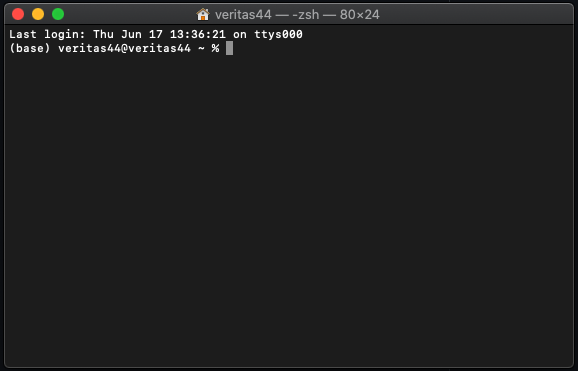

← [Why is the Command Line Useful?](03-why-is-the-command-line-useful.md)&nbsp;&nbsp;&nbsp;|&nbsp;&nbsp;&nbsp;[Prefatory Pro Tips](05-prefatory-pro-tips.md) →

---

# 4. Getting to the Command Line

## macOS

If you're using macOS:

1. Click the Spotlight Search button (the magnifying glass) in the top right of your desktop.

2. Type `terminal` into the bar that appears.

3. Select the first item that appears in the list.

4. When the Terminal pops up, you will likely see either a window with black text over white background or colored text over a black background.

    

Please note: You can change the color of your Terminal or BashShell background and text by selecting `Shell` from the top menu bar, then selecting a theme from the menu under `New Window`.

Bonus points: if you really want to get the groove of just typing instead of pointing and clicking, you can hold the <kbd>command (⌘)</kbd> key while and press <kbd>space</kbd> to pull up Spotlight search, start typing `Terminal,` and then hit <kbd>enter</kbd> to open a terminal window. This will pull up a terminal window without touching your mousepad. For super bonus points, try to navigate like this for the next fifteen minutes, or even the rest of this session—it is tricky and sometimes a bit tiring when you start, but you can really pick up speed when you practice!

## Windows

We won't be using Windows's own non-UNIX version of the command line. Instead, we will use Git Bash. If you haven't installed it yet, you can follow [these instructions](https://github.com/DHRI-Curriculum/install/blob/v2.0/guides/git.md). The reason we use Git Bash as the command line on Windows is that it makes you able to run the same commands as you would on a computer running macOS or Linux. Git Bash includes core utilities available on Linux that are not available on Windows.

1. Look for Git Bash in your programs menu and open.

2. If you can't find the git folder, just type `git bash` in the search box and select `git bash` when it appears.

3. Open the program.

4. When the terminal pops up, you will likely see either a window with black text over white background or colored text over a black background.You know you're in the right place when you see the `$`.

  _Note that the sign for you being in the right place might also be a `%` or a `#` depending on your operating system._

Bonus points: if you really want to get the groove of just typing instead of pointing and clicking, you can press <kbd>windows</kbd> to open the Start menu, start typing `git bash` and then hit <kbd>enter</kbd> to open a git bash window. This will pull up a command window without touching your mousepad.

## Command Prompt `$`

`$`, which we will refer to as the "command prompt," is the place you type commands you wish the computer to execute. We will now learn some of the most common commands.

When you see the `$`, you're in the right place. As noted above, however, the sign varies somewhat between systems, and sometimes the sign is a `%` or a `#`. We call the sign the _command prompt_; it lets us know the computer is ready to receive a command.

In the following lessons, we will refer to the command prompt using a `$`. Just make a note now of your sign, if it differs from the dollar sign. You will be able to follow along just fine as long as you understand that they all are different ways of knowing that you are "at the _command prompt_."

---

← [Why is the Command Line Useful?](03-why-is-the-command-line-useful.md)&nbsp;&nbsp;&nbsp;|&nbsp;&nbsp;&nbsp;[Prefatory Pro Tips](05-prefatory-pro-tips.md) →