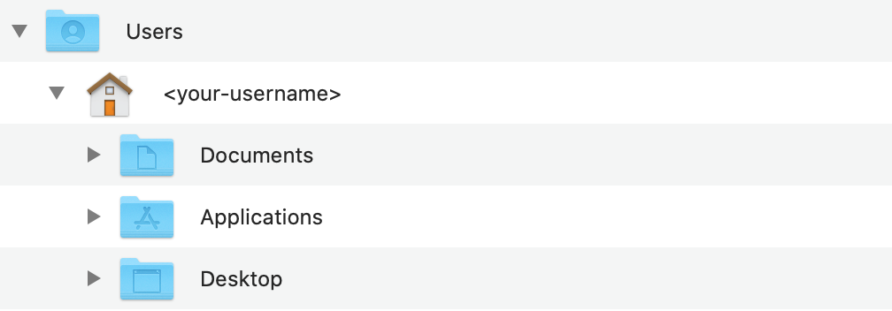

← [Prefatory Pro Tips](05-prefatory-pro-tips.md)&nbsp;&nbsp;&nbsp;|&nbsp;&nbsp;&nbsp;[Creating Files and Folders](07-creating-files-and-folders.md) →

---

# 6. Navigation

## Getting started: know thyself

You may also see your username to the left of the command prompt `$`. Let's try our first command. Type the following and press <kbd>enter</kbd> on your keyboard:

```console
$ whoami
```

The `whoami` command should print out your username. Congrats, you've executed your first command! This is a basic pattern of use in the command line: type a command, press <kbd>enter</kbd> on your keyboard, and receive output.

## Orienting Yourself in the Command Line: Folders

OK, we're going to try another command. But first, let's make sure we understand some things about how your computer's filesystem works.

Your computer's files are organized in what's known as a hierarchical filesystem. That means there's a top level or `root` folder on your system. That folder has other folders in it, and those folders have folders in them, and so on. You can draw these relationships in a tree:



The root or highest-level folder on macOS is just called `/`. We won't need to go in there, though, since that's mostly just files for the operating system. On Windows, the root directory is usually called `C:`. (If you are curious why `C:` is the default name on Windows, you can read about it [here](http://www.todayifoundout.com/index.php/2015/04/c-drive-default-windows-based-computers-2).)

Note that we are using the word "directory" interchangeably with "folder"—they both refer to the same thing.

OK, let's try a command that tells us where we are in the filesystem:

```console
$ pwd
```

You should get output like `/Users/your-username`. That means you're in the `your-username` directory in the `Users` folder inside the `/` or root directory. This directory is often called the "home" directory.

On Windows, your output would instead be `C:/Users/your-username`. The folder you're in is called the working directory, and `pwd` stands for "print working directory." "Print" as a word can be somewhat misleading. The command `pwd` won't actually print anything except on your screen. This command is easier to grasp when we interpret "print" as "display."

Now we know "where" we are. But what if we want to know what files and folders are in the `your-username` directory, a.k.a. the working directory? Try entering:

```console
$ ls
```

You should see a number of folders, probably including `Documents`, `Desktop`, and so on. You may also see some files. These are the contents of the current working directory. `ls` will "list" the contents of the directory you are in.

Wonder what's in the `Desktop` folder? Let's try navigating to it with the following command:

```console
$ cd Desktop
```

The `cd` command lets us "change directory." (Make sure the "D" in "Desktop" is capitalized.) If the command was successful, you won't see any output. This is normal—often, the command line will succeed silently.

So how do we know it worked? That's right, let's use our `pwd` command again. We should get:

```console
$ pwd
/Users/your-username/Desktop
```

Now try `ls` again to see what's on your desktop. These three commands—`pwd`, `ls`, and `cd`—are the most commonly used in the terminal. Between them, you can orient yourself and move around.

## Challenge

Before moving on, take a minute to navigate through our computer's file system using the command line. Use the three commands you've just learned—`pwd`, `ls` and `cd`—eight (8) times each. Go poking around your `Photos` folder, or see what's so special about that root `/` directory. When you're done, come back to your "home" folder with

```console
$ cd ~
```

(That's a tilde <kbd>~</kbd>, on the top left of your keyboard.) One more command you might find useful is `cd ..` which will move you one directory up in the filesystem. That's a `cd` with two periods after it:

```console
$ cd ..
```

### Compare with the GUI

It's important to note that this is the same old information you can get by pointing and clicking displayed to you in a different way.

Go ahead and use pointing and clicking to navigate to your working directory—you can get there a few ways, but try starting from "My Computer" and clicking down from there. You'll notice that the folder names should match the ones that the command line spits out for you, since it's the same information! We're just using a different mode of navigation around your computer to see it.

## Solution

1. Type `pwd` to see where on your computer you are located.
2. Type `cd name-of-your-folder` to enter a subfolder.
3. Type `ls` to see the content of that folder.
4. Type `cd ..` to leave that folder.
5. Type `pwd` to make sure you are back to the folder where you wish to be.
6. Type `cd ~` to go back to your home folder.
7. Type `pwd` to make sure you are in the folder where you wish to be.
8. Type `cd /` to go back to your root folder.
9. Type `ls` to see the content of folder you are currently in.
10. Type `pwd` to make sure you are in the folder where you wish to be.
11. Type `cd name-of-your-folder` to enter a subfolder.

## Evaluation

What command do you run if you are trying to identify where in the filesystem you are currently located/working?
- $ `ls`
- $ `pwd`*
- $ `cd`
- $ `whoami`

When and why would you want to use the command line as opposed to your operating system's GUI?

## Keywords

Do you remember the glossary terms from this section?

- [Filesystem](https://github.com/DHRI-Curriculum/glossary/blob/v2.0/terms/filesystem.md)
- [GUI](https://github.com/DHRI-Curriculum/glossary/blob/v2.0/terms/gui.md)
- [Root](https://github.com/DHRI-Curriculum/glossary/blob/v2.0/terms/root.md)

---

← [Prefatory Pro Tips](05-prefatory-pro-tips.md)&nbsp;&nbsp;&nbsp;|&nbsp;&nbsp;&nbsp;[Creating Files and Folders](07-creating-files-and-folders.md) →