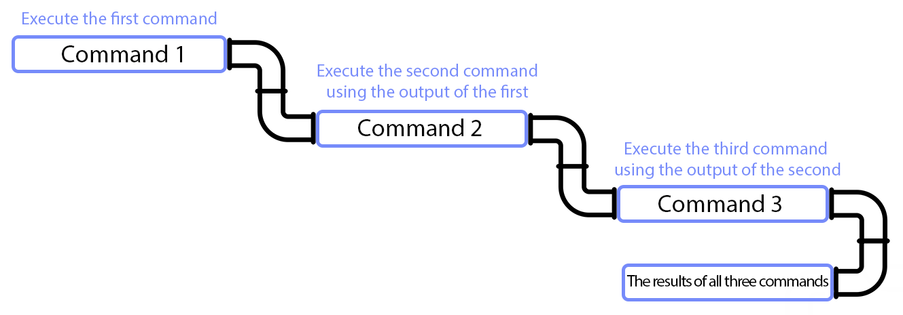
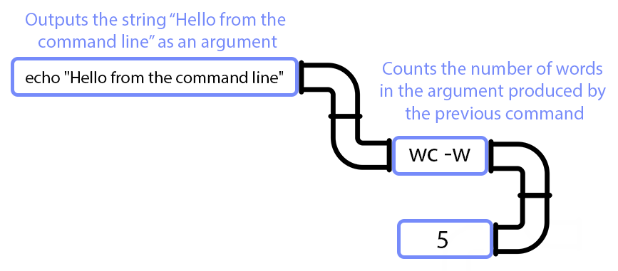

← [Creating a Cheat Sheet](08-creating-a-cheat-sheet.md)&nbsp;&nbsp;&nbsp;|&nbsp;&nbsp;&nbsp;[Exploring Text Data](10-exploring-text-data.md) →

---

# 9. Pipes

So far, you've learned a number of commands and one special symbol, the `>` or redirect. Now we're going to learn another, the `|` or "pipe."

Pipes let you take the output of one command and use it as the input for another.



Let's start with a simple example:

```console
$ echo "Hello from the command line" | wc -w
5
```


In this example, we take the output of the `echo` command ("Hello from the command line") and pipe it to the `wc` or word count command, adding a flag `-w` for number of words. The result is the number of words in the text that we entered. Flags marked with hyphens, such as `-l` or `-m`, indicate options which belong to specific commands.

Let's try another. What if we wanted to put the commands in our cheat sheet in alphabetical order?

Use `pwd` and `cd` to make sure you're in the folder with your cheat sheet. Then try:

```console
$ cat cheat-sheet.txt | sort
```

You should see the contents of the cheat sheet file with each line rearranged in alphabetical order. If you wanted to save this output, you could use a `>` to print the output to a file, like this:

```console
$ cat cheat-sheet.txt | sort > new-cheat-sheet.txt
```

## Evaluation

What do pipes allow you to do?

- Pipes let you take the output of one command and use it as the input for another.*
- Pipes allow you to combine multiple commands in a single line.*
- Pipes let you work on multiple files at the same time.

---

← [Creating a Cheat Sheet](08-creating-a-cheat-sheet.md)&nbsp;&nbsp;&nbsp;|&nbsp;&nbsp;&nbsp;[Exploring Text Data](10-exploring-text-data.md) →
